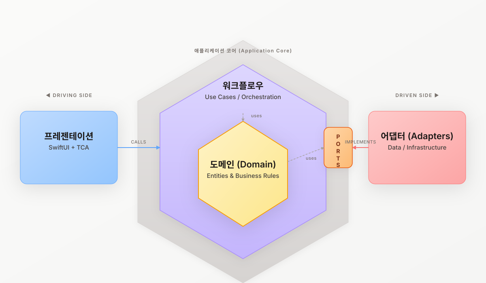

# Jacsim

[](https://developer.apple.com/ios/)
[](https://swift.org)
[](https://tuist.dev)
[](#architecture-at-a-glance)

작심(Jacsim)은 오늘의 목표를 만들고, 사진과 메모로 매일 인증하며, 캘린더와 위젯으로 흐름을 돌아보는 iOS 앱입니다.
`홈 -> 생성 -> 기록 -> 회고` 흐름을 SwiftUI + @Observable로 구현하고, Port & Adapter와 Tuist 멀티모듈 구조로 UI, 도메인, 인프라 관심사를 분리합니다.

## Key Highlights

- **SwiftUI + @Observable**: 화면 상태, 액션, 비동기 효과를 명시적인 모델 흐름으로 관리합니다.
- **Port & Adapter**: Presentation, Use case, Domain, Adapter 경계를 분리해 변경 영향을 줄입니다.
- **Tuist 멀티모듈**: 앱, 조립 레이어, 도메인, 포트, 어댑터, 디자인 시스템을 모듈 단위로 관리합니다.

## Product Overview

- **홈**: 오늘 가장 중요한 작심과 진행 중인 작심을 한 화면에서 확인합니다.
- **생성**: 제목, 기간, 사진, 알림을 단계별로 설정하며 새 작심을 만듭니다.
- **기록**: 인증 사진과 한 줄 메모로 오늘의 진행 상황을 남깁니다.
- **회고**: 캘린더와 전체 목록에서 진행, 성공, 실패 흐름을 돌아봅니다.
- **설정**: 알림, 테마, 사용 안내, 오픈소스 라이선스 정보를 관리합니다.

## Architecture At A Glance

<p align="center">
  
</p>

<details>
<summary>텍스트 버전</summary>

```text
Presentation(App) ──▶ Client/Application orchestration ──▶ ExternalInterface ports
      │                                                               ▲
      └──────────────────────────── Domain rules ─────────────────────┘
                                      │
                                      ▼
                               Data adapters
```

</details>

### 모듈 책임

| 모듈 | 책임 |
|---|---|
| `Projects/Jacsim` | 앱 진입점, Presentation 화면, Application orchestration |
| `Projects/JacsimWidget` | Today/Streak WidgetKit extension |
| `Projects/Domain` | 비즈니스 규칙, 엔티티, 도메인 서비스 |
| `Projects/ExternalInterface` | `Ports`: 계약과 경계 인터페이스 |
| `Projects/Data` | `Adapters`: SwiftData, UserDefaults, 알림 등 외부 I/O 구현 |
| `Projects/Modules/Core` | 공통 유틸리티와 익스텐션 |
| `Projects/Modules/DSKit` | 디자인 토큰과 공용 UI 컴포넌트 |
| `Projects/Modules/ThirdPartyLibs` | 외부 라이브러리 집합과 의존성 정리 |

## Getting Started

### Requirements

- Xcode
- Tuist
- iOS 26+ 시뮬레이터 또는 디바이스

### Local Build

```bash
tuist install
tuist generate
tuist build Jacsim
```

### Tests

```bash
tuist test Jacsim
tuist test Domain
tuist test Data
tuist test ExternalInterface
```

> `DesignSystem`에는 전용 unit test target이 없습니다. DSKit 변경은 `tuist build Jacsim`과 영향받는 downstream scheme 테스트로 검증합니다.

## Development Guide

- 새 화면은 `*Feature.swift` + `*View.swift` 쌍으로 구성합니다.
- Presentation은 `JacsimDependencies`가 노출하는 port, query, use case dependency를 사용하고 concrete adapter를 직접 참조하지 않습니다.
- read-only 화면 조립은 query surface를 우선 사용하고, multi-step 비즈니스 흐름은 use case로 호출합니다.
- trivial wrapper use case를 늘리지 않고, 단순 I/O는 기존 port dependency를 우선 사용합니다.
- 상세 규칙, 작업 경계, 테스트 기준은 [AGENTS.md](AGENTS.md)를 기준으로 따릅니다.

## 로컬 Firebase 설정
- `Projects/Jacsim/Resources/GoogleService-Info.plist`는 `.gitignore` 대상이며 커밋하지 않습니다.
- 로컬 빌드는 `scripts/local/prepare-google-service-info.sh`가 `$HOME/Downloads/GoogleService-Info.plist`를 자동으로 복사해 사용합니다.
- 다른 위치의 plist를 쓰려면 `JACSIM_GOOGLE_SERVICE_INFO_PLIST`에 파일 경로를 지정합니다.

### 공식 문서
- Getting started with Xcode Cloud: https://developer.apple.com/documentation/xcode/getting-started-with-xcode-cloud
- Add Xcode Cloud workflows: https://developer.apple.com/help/app-store-connect/manage-builds/add-xcode-cloud-workflows/
- Configure workflow actions: https://developer.apple.com/help/app-store-connect/manage-builds/configure-actions-for-xcode-cloud-workflows/
- Custom build scripts: https://developer.apple.com/documentation/xcode/writing-custom-build-scripts
- Xcode Cloud environment variables: https://developer.apple.com/documentation/xcode/environment-variable-reference
- TestFlight internal testers: https://developer.apple.com/help/app-store-connect/test-a-beta-version/invite-internal-testers

## Documentation Map

- [AGENTS.md](AGENTS.md): 저장소 전체 작업 규칙, 테스트 기준, 모듈 가이드 진입점
- [Projects/Jacsim/AGENTS.md](Projects/Jacsim/AGENTS.md): app presentation과 dependency wiring 규칙
- [design-system/jacsim/MASTER.md](design-system/jacsim/MASTER.md): 디자인 시스템 규칙과 UI 원칙
- [Docs/design/CLAUDE_DESIGN_SSOT.md](Docs/design/CLAUDE_DESIGN_SSOT.md): Claude Design 기반 SSoT
- [Docs/design/VISIBILITY_MATRIX.md](Docs/design/VISIBILITY_MATRIX.md): Social visibility matrix
- [Docs/migration/tca-to-swiftui-async-await/PLAN.md](Docs/migration/tca-to-swiftui-async-await/PLAN.md): SwiftUI/async-await migration plan

## Contributing

- 브랜치는 `develop`에서 `feature/*`, `fix/*`, `refactor/*`를 사용합니다.
- 커밋 prefix는 `Feat:`, `Fix:`, `Refactor:`, `Chore:`, `Docs:`를 사용합니다.
- PR 전에는 `tuist generate`, `tuist build Jacsim`, 변경 모듈 테스트를 실행합니다.
- 세부 절차와 컨벤션은 [AGENTS.md](AGENTS.md)에 정리되어 있습니다.
